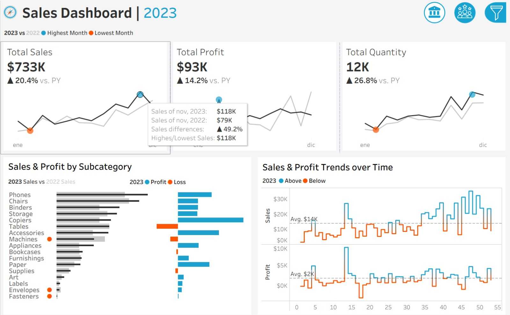
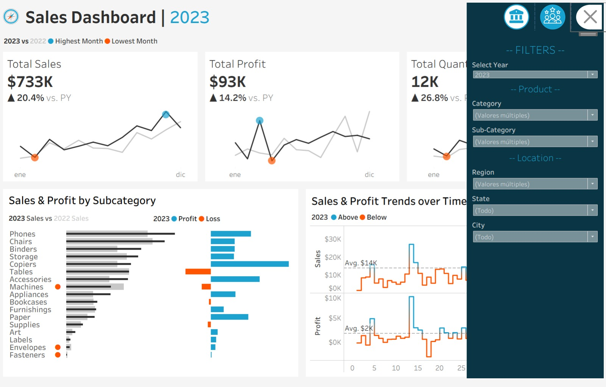
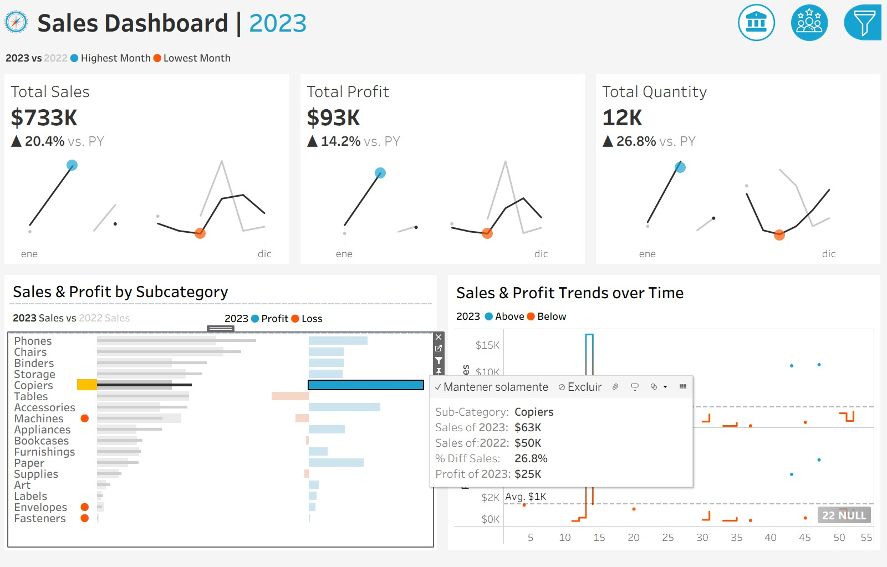
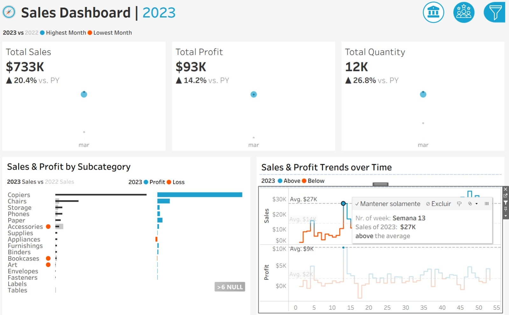
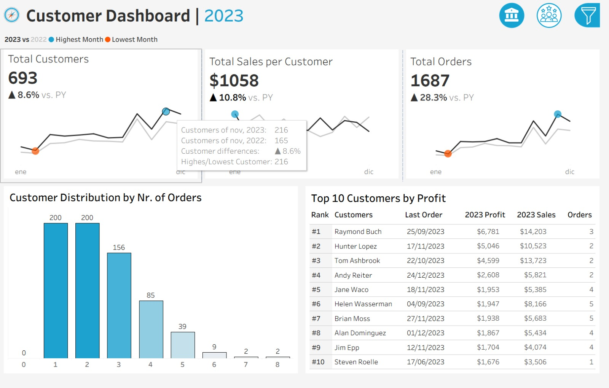
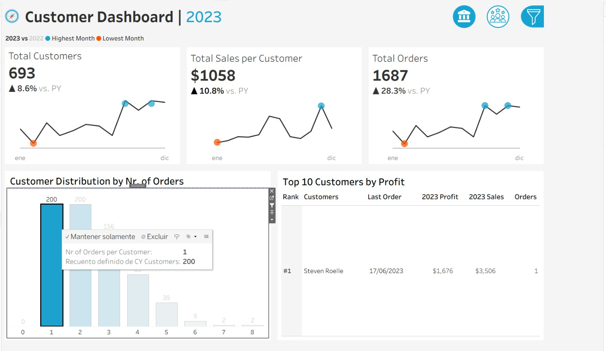
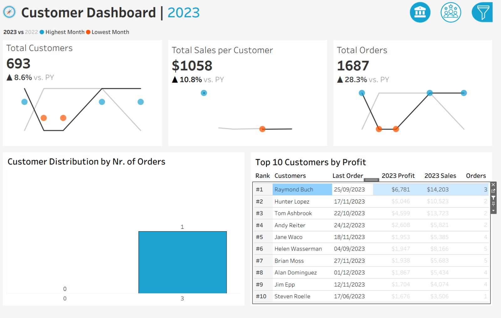

# 📊 Data Analytics Project | Sales & Customer Analytics Dashboard (Tableau)
## 🚀 Overview
This project showcases an **interactive Tableau dashboard** designed for **Sales Analytics** and **Customer Analytics**, with a strong focus on **data-driven decision-making**, **KPI tracking**, and **dynamic data visualization**.

The solution is structured into two fully interactive analytical views:
- **Sales Performance Dashboard**
- **Customer Insights Dashboard**

Both views allow users to explore data dynamically through filtering by:
- **Year**
- **Product Category**
- **Geographic Location**

---

## 🎯 Business Context
Organizations need clear and interactive reporting tools to monitor business performance, identify trends, and improve strategic decision-making.

This dashboard was developed to:
- Track **sales performance** and **profitability**
- Analyze **customer behavior and distribution**
- Support **interactive exploration of business metrics**
- Improve visibility of **performance trends**, **seasonality**, and **customer segmentation**

---

## ⚠️ Data Disclaimer
The original dataset is not included in this repository.

This project demonstrates:
- Dashboard design and analytical structure
- KPI definition and visualization logic
- Interactive filtering and user experience design
- Business Intelligence storytelling using Tableau

---

## 🏗️ Dashboard Structure
The solution is divided into two main analytical views:

### 1. Sales Performance Dashboard
Focused on revenue, profitability, trends, and product analysis.

### 2. Customer Insights Dashboard
Focused on customer growth, order behavior, segmentation, and top-customer identification.

---

## 📈 Sales Dashboard

The **Sales Analytics Dashboard** includes the following features:

- **KPI indicators** for:
  - Total Sales
  - Total Profit
  - Year-over-Year (YoY) variation

- **Time series analysis** with annual performance trends
- Identification of **maximum and minimum performance points**
- Breakdown of **Sales and Profit by product subcategory**
- **Weekly trend analysis** to identify seasonality and performance patterns
- **Interactive visualizations** acting as dynamic filters across the dashboard
- **Tooltips** providing additional analytical details

### Sales Dashboard Views

---

## 👥 Customer Dashboard

The **Customer Analytics Dashboard** includes:

- **KPI indicators** for:
  - Total Customers
  - YoY customer growth
  - Annual evolution trends

- Visualization of **customer distribution by number of orders** using **histogram analysis**
- Identification of **Top 10 customers** based on transactional data
- Fully interactive filtering for **cross-dashboard exploration**
- **Tooltips** for enhanced user interpretation

### Customer Dashboard Views

---

## 📊 Key Features
- **Interactive Tableau Dashboard**
- **Sales Performance Analysis**
- **Customer Analytics**
- **KPI Tracking**
- **Year-over-Year (YoY) Analysis**
- **Time Series Analysis**
- **Trend Analysis**
- **Customer Segmentation**
- **Histogram Analysis**
- **Top Customer Identification**
- **Dynamic Filtering**
- **Tooltips and Interactive Exploration**
- **Business Intelligence Reporting**

---

## 🧠 Analytical Capabilities
This dashboard enables users to:

- Monitor **sales, profit, and customer KPIs**
- Explore **annual and weekly business trends**
- Detect **seasonal patterns**
- Analyze **subcategory performance**
- Understand **customer order distribution**
- Identify **high-value customers**
- Use **interactive filters** for self-service analysis

---

## 🛠️ Tools & Technologies
- **Tableau**
- **Data Visualization**
- **Business Intelligence (BI)**
- **Dashboard Design**
- **KPI Monitoring**
- **Sales Analysis**
- **Customer Analytics**
- **Interactive Filtering**
- **User Experience Optimization**

---

## 💼 Business Impact
- Improved **visibility of sales and customer performance**
- Enabled **faster and more informed decision-making**
- Supported **self-service analytics**
- Enhanced identification of **trend patterns and customer behavior**
- Strengthened **performance monitoring through interactive dashboards**

---

## 📌 Key Skills Demonstrated
- **Data Analytics**
- **Business Intelligence**
- **Tableau Dashboard Development**
- **Data Visualization**
- **KPI Tracking**
- **Sales Analysis**
- **Customer Segmentation**
- **Time Series Analysis**
- **Trend Analysis**
- **Interactive Dashboard Design**
- **Performance Metrics Analysis**
- **Data-Driven Decision Making**

---

## 🔮 Future Improvements
- Add profitability analysis by region and customer segment
- Integrate forecasting models for sales trends
- Expand customer behavior analysis with retention metrics
- Publish an interactive Tableau Public version for online access

---

## 📄 Notes
This project demonstrates practical application of **Tableau, Business Intelligence, and Data Analytics** to build interactive dashboards that support **sales performance monitoring** and **customer insight generation**, aligned with roles such as:

- **Data Analyst**
- **Business Intelligence Analyst**
- **Reporting Analyst**
- **Commercial / Sales Analyst**
``
